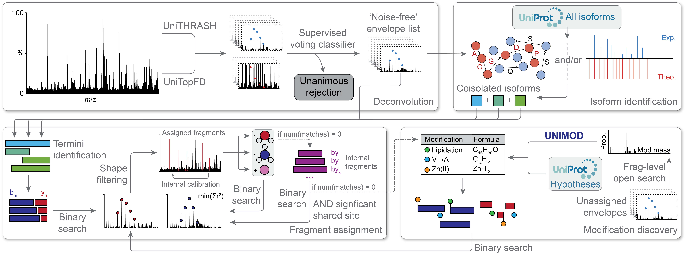

<div align="center">
  
</div>

precisION (**precis**e and accurate **I**dentification **O**f **N**ative proteoforms) is an open-source software package that employs a hierarchical approach for the comprehensive analysis of native top-down mass spectrometry (nTDMS) data.
precisION specifically aims to facilitate accurate interpretation of sequence ions in the absence of an intact mass, defined molecular composition, and/or complete database of protein modifications.
However, the workflows implemented in precisION are also general, allowing the package to effectively analyse most intact protein fragmentation spectra.
precisION is developed and maintained in the [Robinson group](https://robinsonweb.chem.ox.ac.uk/) at the [Kavli Institute for Nanoscience Discovery, University of Oxford](https://kavlinano.ox.ac.uk/).



Our primary goal for precisION was to design a software package that facilitates continual user involvement throughout spectral analysis.
This supervised approach combines the benefits of automated analyses (and the associated large-scale statistical tests) with the expertise of MS practitioners who can visually evaluate putative ion assignments.
We reasoned that such semi-automated analyses would ensure accurate and informative spectral interpretation.
To assist users in interpreting fragmentation data, we have designed and implemented several new algorithms for spectral analysis.
These methods have been combined with additional state-of-the art approaches and integrated into a statistically-grounded workflow that is optimised to reduce the likelihood of identifying spurious fragment ions.

If you have questions about the use of precisION please read the documentation first (including faqs), as it is likely that others have had the same query.
For any remaining questions, feature suggestions, or bug reports, please send me an email (jack.bennett@chem.ox.ac.uk) and I will try to help.

### Documentation and Tutorials
Full documentation for precisION and a quick start guide can be found on the [Releases](https://github.com/kanalstrahlen/precisION/releases) page.
Additionally, we have made two video tutorials.
One ([Link](https://youtu.be/fgZHkNpur6Q)) describes the software's basic functionality, whilst the other ([Link](https://youtu.be/sgwC2zw7x4Y)) explores more powerful functions.
The example datasets for these tutorials are linked in the video descriptions.

## Installing precisION
Due to the implementation of external deconvolution algorithms, precisION is currently only compatible with Windows 10 or later on an X64-based PC.
Running the software does not require a particularly powerful computer by modern standards, but at least 16 GB of RAM is highly recommended.
No non-standard hardware is required.

### Installing Pre-compiled Binaries (Most Users)
Portable precisION executables compatible with 64-bit versions of Windows 10 or later are available on the [Releases](https://github.com/kanalstrahlen/precisION/releases) page.
These executables have been tested on Windows 10 Enterprise 22H2 using a Dell OptiPlex 7000 (Intel Core i5-12500, 16 GB RAM or Intel Core i7-12700, 64 GB RAM) PC.
All you need to do is decompress the folder, transfer it to somewhere suitable, and load the GUI by opening the `precisION.exe` file.
Once downloaded, installation should take less than 2 minutes.

### Executing the Source Code
precisION can be directly executed by Python 3 making it easy to use and modify.
This option is also a little quicker.
I recommend installing Anaconda and creating a new Python 3.9 virtual environment specifically for precisION.
```bash
conda create --name precisION python=3.9 
conda activate precisION
```
You can the navigate to the precisION folder in your terminal and download the required dependencies.
```bash
cd .\precisION-main
pip install -r .\requirements.txt
```
precisION can the be launched without any further steps.
```bash
python .\launcher.py
```
If you wish to use the proteoform databases, these must be downloaded as described below.

### Proteoform Databases
Isoform databases for most major model organisms can also be installed from [Dropbox](https://www.dropbox.com/scl/fo/i8bce231gj5ymacx9o1cf/AJ0WVSWEHXeFhb3gbLWeeQA?rlkey=wko5zht5a2d7z6h625ci2qi32&dl=0). 
They will be updated periodically but should not change drastically.
We suggest to install these files during the initial setup of the software and move them into a folder in the precisION directory in a folder named `Databases`.

### Generating Input Files
Input files should be tab- or space-delimited `.txt` files containing two columns: _m_/_z_ and intensity.
An example is provided below.
```bash
9.900279907399780086e+02 0.000000000000000000e+00
9.900300808898358582e+02 0.000000000000000000e+00
9.900321710463127829e+02 0.000000000000000000e+00
9.900342612094088963e+02 0.000000000000000000e+00
9.999252737591029927e+02 0.000000000000000000e+00
9.999273953299101549e+02 0.000000000000000000e+00
9.999295169074694059e+02 0.000000000000000000e+00
9.999316384917807454e+02 0.000000000000000000e+00
9.999337600828444010e+02 7.312207818031311035e-01
9.999358816806600316e+02 0.000000000000000000e+00
9.999380032852280920e+02 0.000000000000000000e+00
9.999401248965482409e+02 0.000000000000000000e+00
9.999422465146205923e+02 0.000000000000000000e+00
```

For data acquired using Thermo Fisher instruments, such files can be generated by right clicking the spectrum, then selecting `Export → Clipboard (Exact Mass)`.
Paste the clipboard contents into any text editor (e.g. Sublime Text or Notepad++) and delete the scan header.
Save the `.txt` file in a folder (this folder can contain other related spectra as `.txt` files) with a descriptive name such as `proteinA_4452iso10Th_hcd30nce.txt`.

**Please note that the path to the files cannot contain a period.**
We recommend storing these files in a folder such as `C:/precisIONfiles/yourProjectName/`, where each project contains all related spectra e.g., of a single protein.

### Example Datasets
An example dataset is provided in the `./ExampleDataFiles/` directory.
This spectrum was acquired from the fragmentation of a native protein in bovine retina.
Please follow the instructions in the provided documentation (`precisionDocumentation.pdf` and `precisionQuickStartGuide.pdf`) to process this spectrum.

For this example, rapid deconvolution should take less than a minute and extensive deconvolution should take approx. 15 minutes.
After training (200 envelope traning set), envelope classification should take approx. 1.5 min.
Constructing the proteoform ion database and conducting the open search to idenitfy the protein should take approx. 15 s.
The fragment-level open search with a mass offset range of -100 to 500 Da should take approx. 25 s.


## Further Information
### Citation


### Funding Acknowledgements
precisION was developed as part of the project ‘A trans-omic platform to define molecular interactions underlying anhedonia at the blood–brain interface’ which was supported by Wellcome Leap as part of the Multi-Channel Psych Program. Additionally, precisION's development was also supported by a Medical Research Council programme grant (MR/V028839/1) and a Wellcome Trust Award (221795/Z/20/Z).

### Third-Party Licenses
This software includes third-party components under various open-source licenses. Please see the `licenses` folder for details on each dependency's license, and refer to the `NOTICE` file for attributions.
